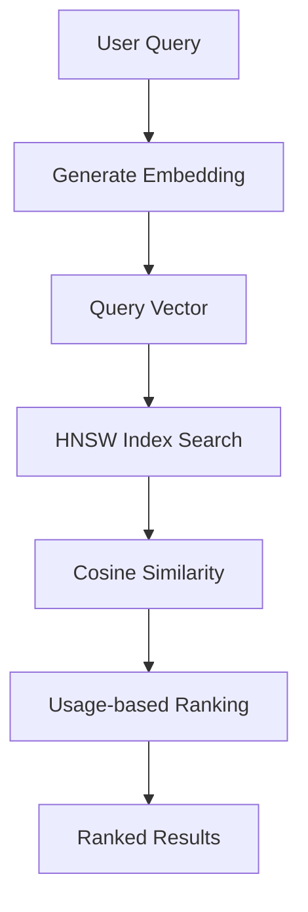

# Ragdoll Engine Architecture

## Overview

The Ragdoll engine implements a comprehensive Retrieval Augmented Generation (RAG) system using a modular, layered architecture. This document provides a detailed view of the system components and their relationships.

## System Architecture Diagram

```mermaid
graph TB
    %% External Systems
    subgraph "External Systems"
        LLM[AI Providers<br/>OpenAI, Anthropic, Google<br/>Azure, Ollama, HuggingFace]
        Redis[Redis<br/>Background Jobs]
        Files[File System<br/>Documents & Content]
    end

    %% Rails Application Layer
    subgraph "Rails Application"
        Routes[Routes<br/>Web & API Endpoints]
        Auth[Authentication<br/>& Authorization]
        
        subgraph "Web Interface"
            Dashboard[Dashboard Controller<br/>Analytics & Overview]
            Documents[Documents Controller<br/>CRUD & Bulk Operations]
            Search[Search Controller<br/>Semantic Search UI]
            Config[Configuration Controller<br/>Settings Management]
        end
        
        subgraph "API Layer"
            APIv1[API v1 Controllers<br/>REST Endpoints]
            WebAPI[AJAX Endpoints<br/>Real-time Features]
        end
    end

    %% Ragdoll Engine Core
    subgraph "Ragdoll Engine Core"
        subgraph "Client Interface"
            Client[Ragdoll::Client<br/>Simplified API]
            ModuleMethods[Module Methods<br/>Convenience Access]
        end
        
        subgraph "Core API"
            API[Ragdoll::API<br/>Main Business Logic]
            Config2[Ragdoll::Configuration<br/>Multi-Provider Settings]
        end
        
        subgraph "Service Layer"
            EmbeddingService[EmbeddingService<br/>Vector Generation]
            DocumentParser[DocumentParser<br/>Multi-format Processing]
            TextChunker[TextChunker<br/>Intelligent Segmentation]
            SummarizationService[SummarizationService<br/>AI Summarization]
        end
        
        subgraph "Background Processing"
            ImportJob[ImportFileJob<br/>Document Processing]
            ImportDirJob[ImportDirectoryJob<br/>Batch Processing]
            JobManager[ImportJobManager<br/>Job Coordination]
        end
    end

    %% Data Layer
    subgraph "Data Layer (PostgreSQL + pgvector)"
        subgraph "Core Tables"
            DocTable[(ragdoll_documents)<br/>Content & Metadata<br/>Processing Status]
            EmbTable[(ragdoll_embeddings)<br/>Vector Embeddings<br/>Chunk Content]
            SearchTable[(ragdoll_searches)<br/>Query Analytics<br/>Performance Metrics]
        end
        
        subgraph "Indexes & Extensions"
            VectorIndex[HNSW Vector Index<br/>Cosine Similarity]
            GinIndex[GIN Indexes<br/>JSONB Metadata]
            Extensions[PostgreSQL Extensions<br/>vector, pg_trgm, fuzzystrmatch]
        end
    end

    %% ActiveRecord Models
    subgraph "ActiveRecord Models"
        DocModel[Ragdoll::Document<br/>Business Logic<br/>Validations & Scopes]
        EmbModel[Ragdoll::Embedding<br/>Vector Operations<br/>Usage Tracking]
        SearchModel[Ragdoll::Search<br/>Analytics Queries<br/>Performance Tracking]
    end

    %% UI Components
    subgraph "UI Components (Bootstrap 5)"
        Views[ERB Templates<br/>Responsive Design]
        Assets[CSS & JavaScript<br/>Chart.js, Font Awesome]
        PWA[Progressive Web App<br/>Manifest & Service Worker]
    end

    %% Flow Connections
    Routes --> Auth
    Auth --> Dashboard
    Auth --> Documents
    Auth --> Search
    Auth --> Config
    Auth --> APIv1
    Auth --> WebAPI

    Dashboard --> Client
    Documents --> Client
    Search --> Client
    Config --> Config2
    APIv1 --> API
    WebAPI --> API

    Client --> API
    ModuleMethods --> Client

    API --> EmbeddingService
    API --> DocumentParser
    API --> TextChunker
    API --> SummarizationService
    API --> ImportJob

    EmbeddingService --> LLM
    SummarizationService --> LLM
    ImportJob --> Redis
    ImportDirJob --> Redis
    JobManager --> Redis

    DocumentParser --> Files
    API --> DocModel
    API --> EmbModel
    API --> SearchModel

    DocModel --> DocTable
    EmbModel --> EmbTable
    SearchModel --> SearchTable

    EmbTable --> VectorIndex
    DocTable --> GinIndex
    SearchTable --> Extensions

    Dashboard --> Views
    Documents --> Views
    Search --> Views
    Config --> Views
    Views --> Assets
    Assets --> PWA

    %% Configuration Flow
    Config2 --> EmbeddingService
    Config2 --> SummarizationService
    Config2 --> DocumentParser
    Config2 --> TextChunker

    %% Styling
    classDef external fill:#e1f5fe,stroke:#01579b,stroke-width:2px
    classDef rails fill:#f3e5f5,stroke:#4a148c,stroke-width:2px
    classDef ragdoll fill:#e8f5e8,stroke:#1b5e20,stroke-width:2px
    classDef data fill:#fff3e0,stroke:#e65100,stroke-width:2px
    classDef ui fill:#fce4ec,stroke:#880e4f,stroke-width:2px

    class LLM,Redis,Files external
    class Routes,Auth,Dashboard,Documents,Search,Config,APIv1,WebAPI rails
    class Client,ModuleMethods,API,Config2,EmbeddingService,DocumentParser,TextChunker,SummarizationService,ImportJob,ImportDirJob,JobManager ragdoll
    class DocTable,EmbTable,SearchTable,VectorIndex,GinIndex,Extensions,DocModel,EmbModel,SearchModel data
    class Views,Assets,PWA ui
```

## Component Analysis

### 1. Layered Architecture

The Ragdoll engine follows a clean **layered architecture pattern** with clear separation of concerns:

**Presentation Layer** → **Business Logic Layer** → **Service Layer** → **Data Access Layer** → **External Systems**

This design provides several key benefits:
- **Maintainability**: Changes in one layer don't affect others
- **Testability**: Each layer can be tested independently
- **Scalability**: Components can be scaled or replaced individually
- **Flexibility**: Multiple interfaces (Web UI, API, CLI) can access the same business logic

### 2. Service-Oriented Design

The **Service Layer** implements a service-oriented architecture with specialized services:

- **EmbeddingService**: Handles vector generation with multi-provider support
- **DocumentParser**: Processes multiple file formats (PDF, DOCX, HTML, etc.)
- **TextChunker**: Implements intelligent text segmentation strategies
- **SummarizationService**: Provides AI-powered document summarization

**Benefits:**
- **Single Responsibility**: Each service has a focused purpose
- **Reusability**: Services can be used across different interfaces
- **Extensibility**: New services can be added without affecting existing ones
- **Configuration**: Services are configurable through the central configuration system

### 3. Multi-Interface Architecture

The system provides **three distinct interfaces** for different use cases:

#### Web Interface (Human Users)
- Bootstrap 5-based responsive UI
- Dashboard with analytics and system overview
- Document management with bulk operations
- Advanced search interface
- Configuration management

#### RESTful API (Applications)
- Versioned API endpoints (`/api/v1/`)
- AJAX endpoints for real-time features
- Structured JSON responses
- Proper HTTP status codes and error handling

#### Client Library (Developers)
- Simplified `Ragdoll::Client` class
- Module-level convenience methods
- Ruby-native object responses
- Error handling with specific exception types

**Benefits:**
- **User Experience**: Optimized interfaces for different user types
- **Integration Flexibility**: Multiple ways to integrate with existing systems
- **API Evolution**: Versioned APIs allow for backward compatibility

### 4. Background Processing Architecture

The engine implements **asynchronous processing** using Sidekiq:


**Benefits:**
- **Non-blocking Operations**: File uploads don't block the web interface
- **Scalability**: Workers can be scaled independently
- **Reliability**: Failed jobs are retried automatically
- **Monitoring**: Job status and performance tracking

### 5. Vector Search Architecture

The **vector search system** leverages PostgreSQL's pgvector extension:

#### Vector Storage Strategy
- **High-dimensional vectors** (1536-3072 dimensions)
- **HNSW indexing** for fast similarity search
- **Multiple embedding models** supported
- **Usage tracking** for intelligent ranking

#### Search Flow


**Benefits:**
- **Semantic Understanding**: Goes beyond keyword matching
- **Performance**: Sub-second search across millions of documents
- **Relevance**: Learning from user interactions
- **Scalability**: Efficient indexing and search algorithms

### 6. Configuration Management

The **centralized configuration system** supports multiple AI providers:

#### Multi-Provider Support
- **OpenAI**: GPT models and text-embedding models
- **Anthropic**: Claude models (with OpenAI embeddings)
- **Google**: Gemini and Vertex AI models
- **Azure**: Azure OpenAI Service
- **Ollama**: Local model hosting
- **HuggingFace**: Open-source models

#### Configuration Benefits
- **Provider Flexibility**: Easy switching between AI providers
- **Cost Optimization**: Choose cost-effective models for different tasks
- **Development vs Production**: Different configurations per environment
- **Feature Flags**: Enable/disable features without code changes

### 7. Data Architecture

The **PostgreSQL schema** is optimized for RAG operations:

#### Table Design
- **ragdoll_documents**: Document metadata, content, and processing status
- **ragdoll_embeddings**: Vector embeddings with usage tracking
- **ragdoll_searches**: Query analytics and performance metrics

#### Index Strategy
- **HNSW indexes** for vector similarity search
- **GIN indexes** for JSONB metadata queries
- **B-tree indexes** for common filter operations
- **Composite indexes** for complex query patterns

### 8. Architectural Strengths

#### Modularity
- **Loosely coupled components** enable independent development
- **Interface segregation** provides appropriate abstractions
- **Dependency injection** makes components testable

#### Scalability
- **Horizontal scaling** through background job workers
- **Database optimization** with proper indexing strategies
- **Caching layers** can be added at multiple levels

#### Extensibility
- **Plugin architecture** for new document parsers
- **Provider abstraction** for new AI services
- **Event system** for custom integrations

#### Developer Experience
- **Multiple APIs** for different skill levels and use cases
- **Comprehensive error handling** with specific exception types
- **Rich documentation** and working examples
- **Testing utilities** and factories

### 9. Architectural Trade-offs

#### Complexity vs Functionality
- **Pro**: Rich feature set with professional-grade capabilities
- **Con**: More complex setup than simple solutions
- **Mitigation**: Excellent documentation and sensible defaults

#### Dependencies vs Control
- **Pro**: Leverages best-in-class external services (OpenAI, PostgreSQL)
- **Con**: Requires external dependencies and API keys
- **Mitigation**: Multiple provider options and local alternatives (Ollama)

#### Performance vs Flexibility
- **Pro**: Optimized for high performance with proper indexing
- **Con**: PostgreSQL with pgvector may be overkill for small applications
- **Mitigation**: Scales from small to large deployments

### 10. Future Architecture Considerations

#### Potential Enhancements
- **Microservices**: Split into separate services for very large deployments
- **Message Queues**: Add pub/sub for real-time features
- **Caching Layer**: Redis caching for frequent queries
- **Federation**: Multi-tenant and cross-system search
- **Vector Databases**: Dedicated vector stores for specialized needs

#### Monitoring and Observability
- **Metrics Collection**: Prometheus/StatsD integration
- **Distributed Tracing**: OpenTelemetry support
- **Health Checks**: Kubernetes-ready health endpoints
- **Performance Monitoring**: APM integration

## Conclusion

The Ragdoll architecture represents a **well-designed, production-ready RAG system** that balances:

- **Simplicity** for developers getting started
- **Power** for advanced use cases
- **Flexibility** for different deployment scenarios
- **Performance** for real-world applications

The modular design, multi-interface approach, and comprehensive service layer make it suitable for everything from simple document search to enterprise-grade knowledge management systems. The architecture's emphasis on configuration flexibility and provider abstraction ensures it can adapt to changing AI landscape and organizational needs.