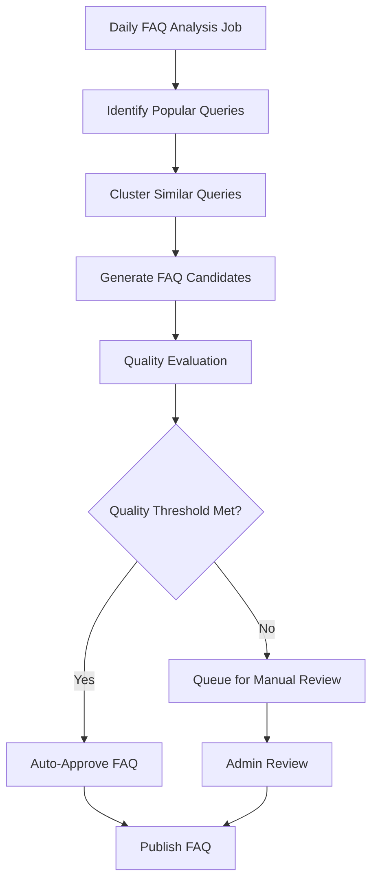
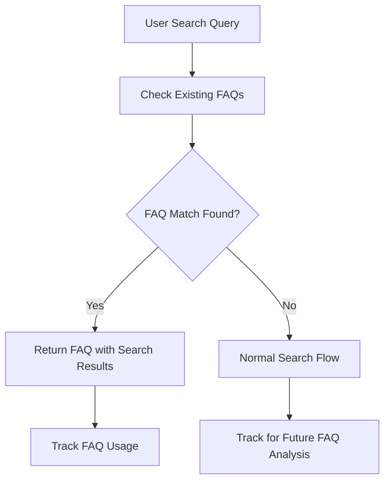

# FAQ Capability Implementation Plan

## 📋 Overview

This plan outlines the implementation of an automated Frequently Asked Questions (FAQ) system for Ragdoll. The system will analyze search patterns, identify common queries, group semantically similar questions, and generate well-formatted answers based on the best-performing search results.

## 🎯 Objectives

1. **Identify Popular Questions**: Analyze search analytics to find frequently asked questions
2. **Semantic Grouping**: Group similar questions that ask the same thing in different ways
3. **Answer Generation**: Create comprehensive, well-formatted answers from top search results
4. **Dynamic Updates**: Keep FAQs current as new searches and content are added
5. **Performance Optimization**: Cache FAQ answers to reduce search load

## 🏗️ Architecture Overview

```
┌─────────────────┐    ┌─────────────────┐    ┌─────────────────┐
│   Search Data   │───▶│   FAQ Engine    │───▶│   FAQ Display   │
│   Analysis      │    │   Processing    │    │   & Management  │
└─────────────────┘    └─────────────────┘    └─────────────────┘
        │                       │                       │
        ▼                       ▼                       ▼
┌─────────────────┐    ┌─────────────────┐    ┌─────────────────┐
│ - Query freq.   │    │ - Clustering    │    │ - FAQ storage   │
│ - Success rate  │    │ - Answer gen.   │    │ - API endpoints │
│ - Performance   │    │ - Quality eval. │    │ - Admin UI      │
└─────────────────┘    └─────────────────┘    └─────────────────┘
```

## 📊 Database Schema Extensions

### New Tables

#### `ragdoll_faqs`
```sql
CREATE TABLE ragdoll_faqs (
  id BIGSERIAL PRIMARY KEY,
  question TEXT NOT NULL,
  answer TEXT NOT NULL,
  question_embedding VECTOR, -- For similarity matching
  category VARCHAR(255),
  priority INTEGER DEFAULT 0,
  auto_generated BOOLEAN DEFAULT true,
  approved BOOLEAN DEFAULT false,
  click_count INTEGER DEFAULT 0,
  helpful_votes INTEGER DEFAULT 0,
  unhelpful_votes INTEGER DEFAULT 0,
  last_updated_at TIMESTAMP,
  created_at TIMESTAMP NOT NULL DEFAULT NOW(),
  updated_at TIMESTAMP NOT NULL DEFAULT NOW(),
  
  -- Metadata
  source_queries JSONB, -- Array of queries that contributed to this FAQ
  source_documents JSONB, -- Documents used to generate answer
  confidence_score DECIMAL(5,3),
  generation_metadata JSONB
);

CREATE INDEX idx_ragdoll_faqs_embedding ON ragdoll_faqs USING hnsw (question_embedding vector_cosine_ops);
CREATE INDEX idx_ragdoll_faqs_category ON ragdoll_faqs (category);
CREATE INDEX idx_ragdoll_faqs_priority ON ragdoll_faqs (priority DESC);
CREATE INDEX idx_ragdoll_faqs_approved ON ragdoll_faqs (approved);
```

#### `ragdoll_faq_clusters`
```sql
CREATE TABLE ragdoll_faq_clusters (
  id BIGSERIAL PRIMARY KEY,
  centroid_embedding VECTOR,
  representative_query TEXT,
  cluster_size INTEGER,
  avg_confidence DECIMAL(5,3),
  total_search_count INTEGER,
  last_analyzed_at TIMESTAMP,
  created_at TIMESTAMP NOT NULL DEFAULT NOW(),
  updated_at TIMESTAMP NOT NULL DEFAULT NOW()
);

CREATE INDEX idx_ragdoll_faq_clusters_embedding ON ragdoll_faq_clusters USING hnsw (centroid_embedding vector_cosine_ops);
```

#### `ragdoll_faq_query_mappings`
```sql
CREATE TABLE ragdoll_faq_query_mappings (
  id BIGSERIAL PRIMARY KEY,
  search_id BIGINT REFERENCES ragdoll_searches(id),
  faq_cluster_id BIGINT REFERENCES ragdoll_faq_clusters(id),
  similarity_score DECIMAL(5,3),
  created_at TIMESTAMP NOT NULL DEFAULT NOW()
);

CREATE INDEX idx_ragdoll_faq_mappings_search ON ragdoll_faq_query_mappings (search_id);
CREATE INDEX idx_ragdoll_faq_mappings_cluster ON ragdoll_faq_query_mappings (faq_cluster_id);
```

### Schema Updates

#### Update `ragdoll_searches` table
```sql
ALTER TABLE ragdoll_searches ADD COLUMN faq_candidate BOOLEAN DEFAULT false;
ALTER TABLE ragdoll_searches ADD COLUMN faq_cluster_id BIGINT REFERENCES ragdoll_faq_clusters(id);
CREATE INDEX idx_ragdoll_searches_faq_candidate ON ragdoll_searches (faq_candidate);
```

## 🔧 Core Components

### 1. FAQ Analysis Engine (`lib/ragdoll/faq/analyzer.rb`)

```ruby
module Ragdoll
  module FAQ
    class Analyzer
      def initialize(options = {})
        @min_search_count = options[:min_search_count] || 5
        @similarity_threshold = options[:similarity_threshold] || 0.85
        @analysis_period = options[:analysis_period] || 30.days
      end

      # Main analysis workflow
      def analyze_and_generate_faqs
        candidate_queries = identify_candidate_queries
        clusters = cluster_similar_queries(candidate_queries)
        generate_faqs_from_clusters(clusters)
      end

      private

      def identify_candidate_queries
        # Find frequently searched, successful queries
        # Criteria: min search count, success rate, recency
      end

      def cluster_similar_queries(queries)
        # Use embedding similarity to group related queries
        # K-means or hierarchical clustering
      end

      def generate_faqs_from_clusters(clusters)
        # For each cluster, generate comprehensive FAQ entry
      end
    end
  end
end
```

### 2. FAQ Generator (`lib/ragdoll/faq/generator.rb`)

```ruby
module Ragdoll
  module FAQ
    class Generator
      def initialize(llm_provider: nil)
        @llm_provider = llm_provider || Ragdoll.configuration.llm_provider
      end

      def generate_faq_answer(query_cluster)
        # 1. Gather top search results from cluster queries
        # 2. Extract and deduplicate content
        # 3. Generate comprehensive answer using LLM
        # 4. Format and structure the response
      end

      private

      def gather_cluster_content(cluster)
        # Collect all search results from queries in cluster
      end

      def generate_comprehensive_answer(question, content_chunks)
        # Use LLM to create well-formatted answer
        prompt = build_faq_prompt(question, content_chunks)
        # Return structured answer with sections
      end

      def build_faq_prompt(question, content)
        <<~PROMPT
          Create a comprehensive FAQ answer for the following question based on the provided content.
          
          Question: #{question}
          
          Content Sources:
          #{content.join("\n\n")}
          
          Requirements:
          - Provide a clear, concise answer
          - Include relevant details and examples
          - Structure with headers if the answer is long
          - Mention any limitations or caveats
          - Use a helpful, professional tone
          
          Answer:
        PROMPT
      end
    end
  end
end
```

### 3. FAQ Manager (`lib/ragdoll/faq/manager.rb`)

```ruby
module Ragdoll
  module FAQ
    class Manager
      def self.refresh_faqs(options = {})
        # Run the full FAQ analysis and generation process
      end

      def self.find_relevant_faq(query)
        # Match user query against existing FAQs
      end

      def self.update_faq_metrics(faq_id, action)
        # Track clicks, votes, etc.
      end

      def self.cleanup_outdated_faqs
        # Remove FAQs that are no longer relevant
      end
    end
  end
end
```

### 4. Models

#### `app/models/ragdoll/faq.rb`
```ruby
module Ragdoll
  class FAQ < ApplicationRecord
    self.table_name = 'ragdoll_faqs'

    validates :question, presence: true, length: { maximum: 1000 }
    validates :answer, presence: true
    validates :confidence_score, numericality: { in: 0..1 }

    scope :approved, -> { where(approved: true) }
    scope :by_category, ->(category) { where(category: category) }
    scope :by_priority, -> { order(priority: :desc, helpful_votes: :desc) }
    scope :popular, -> { order(click_count: :desc) }

    def helpful_ratio
      return 0 if total_votes.zero?
      helpful_votes.to_f / total_votes
    end

    def total_votes
      helpful_votes + unhelpful_votes
    end

    def should_be_updated?
      last_updated_at < 7.days.ago
    end
  end
end
```

## 📈 Implementation Phases

### Phase 1: Foundation (Week 1-2)
- [ ] Create database migrations for FAQ tables
- [ ] Implement basic FAQ models
- [ ] Create search analytics enhancement
- [ ] Basic clustering algorithm for query grouping

### Phase 2: Core Engine (Week 3-4)
- [ ] Implement FAQ Analyzer
- [ ] Build FAQ Generator with LLM integration
- [ ] Create FAQ Manager for lifecycle management
- [ ] Add background jobs for FAQ processing

### Phase 3: API & Integration (Week 5-6)
- [ ] Create FAQ API endpoints
- [ ] Integrate with existing search flow
- [ ] Add FAQ matching to search results
- [ ] Implement FAQ caching

### Phase 4: Management Interface (Week 7-8)
- [ ] Admin interface for FAQ management
- [ ] FAQ approval workflow
- [ ] Analytics dashboard
- [ ] Quality metrics and monitoring

### Phase 5: Enhancement & Optimization (Week 9-10)
- [ ] Performance optimization
- [ ] Advanced clustering algorithms
- [ ] FAQ categorization
- [ ] User feedback integration

## 🔄 Workflow

### Automated FAQ Generation


### Real-time FAQ Matching


## 🛠️ Configuration Options

```ruby
Ragdoll.configure do |config|
  # FAQ-specific settings
  config.faq_enabled = true
  config.faq_min_search_count = 5
  config.faq_similarity_threshold = 0.85
  config.faq_analysis_period = 30.days
  config.faq_auto_approval_threshold = 0.9
  config.faq_max_answer_length = 2000
  config.faq_refresh_interval = 1.day
  
  # FAQ generation prompts
  config.faq_generation_prompt = "..."
  config.faq_improvement_prompt = "..."
end
```

## 📊 Analytics & Monitoring

### FAQ Performance Metrics
- FAQ hit rate (queries answered by FAQs vs regular search)
- FAQ quality scores (user feedback)
- FAQ freshness (how recently updated)
- Content coverage (% of search topics covered by FAQs)

### Dashboard Features
- Most popular FAQs
- FAQ performance trends
- User satisfaction metrics
- Content gap analysis

## 🧪 Testing Strategy

### Unit Tests
- FAQ clustering accuracy
- Answer generation quality
- Query matching precision
- Performance benchmarks

### Integration Tests
- End-to-end FAQ generation workflow
- Real-time search integration
- Admin interface functionality

### Quality Assurance
- Manual review of generated FAQs
- A/B testing for FAQ effectiveness
- User feedback collection

## 🚀 API Endpoints

### Public API
```ruby
# Get relevant FAQs for a query
GET /api/v1/faqs/search?q=query&limit=5

# Get all approved FAQs
GET /api/v1/faqs?category=setup&page=1

# Record FAQ interaction
POST /api/v1/faqs/:id/vote
```

### Admin API
```ruby
# Trigger FAQ analysis
POST /api/v1/admin/faqs/analyze

# Approve/reject FAQ
PATCH /api/v1/admin/faqs/:id

# Get FAQ analytics
GET /api/v1/admin/faqs/analytics
```

## 💡 Advanced Features (Future)

### Machine Learning Enhancements
- Improve clustering with deep learning models
- Personalized FAQ recommendations
- Automatic answer quality scoring

### Content Intelligence
- Identify content gaps from FAQ analysis
- Suggest new documentation topics
- Cross-reference with existing docs

### User Experience
- FAQ chatbot interface
- Interactive FAQ builder
- Community-contributed FAQs

## 🔒 Security Considerations

- Sanitize generated FAQ content
- Implement rate limiting for FAQ generation
- Secure admin interfaces
- Audit trail for FAQ changes

## 📋 Success Criteria

### Quantitative Metrics
- 20% reduction in repeat searches
- 85% user satisfaction with FAQ answers
- 90% FAQ answer accuracy
- Sub-100ms FAQ lookup time

### Qualitative Goals
- Improved user experience
- Reduced support burden
- Better content discoverability
- Enhanced knowledge management

## 🏁 Conclusion

This FAQ system will transform Ragdoll from a pure search engine into an intelligent knowledge management platform. By automatically identifying common questions and generating high-quality answers, it will significantly improve user experience while reducing the load on the search system.

The phased approach ensures manageable implementation while building towards a comprehensive solution that can evolve with user needs and technological advances.