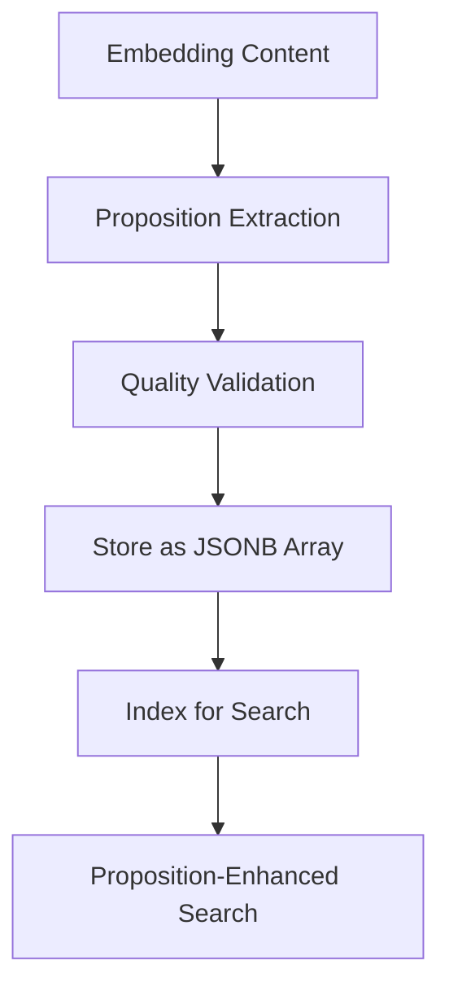
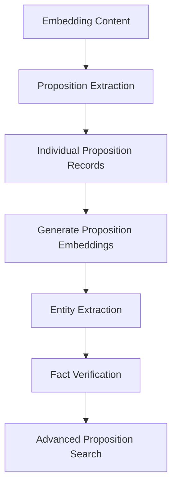

# Propositions Feature Implementation Plan

## 📋 Overview

This plan outlines the implementation of a propositions extraction system for Ragdoll embeddings. The system will analyze each embedding's content and extract simple, atomic statements of fact (propositions) that can be stored and searched independently. This will enhance semantic search by providing more granular, fact-based retrieval capabilities.

## 🎯 Objectives

1. **Atomic Fact Extraction**: Break down content into simple, verifiable statements
2. **Enhanced Search Precision**: Enable searches to match specific facts rather than just content chunks
3. **Fact-Based Retrieval**: Support fact-checking and verification workflows
4. **Semantic Granularity**: Provide finer-grained semantic understanding
5. **Knowledge Graph Foundation**: Create building blocks for future knowledge graph features

## 🏗️ Architecture Overview

```
┌─────────────────┐    ┌─────────────────┐    ┌─────────────────┐
│   Embedding     │───▶│  Proposition    │───▶│   Fact-Based    │
│   Content       │    │   Extraction    │    │    Search       │
└─────────────────┘    └─────────────────┘    └─────────────────┘
        │                       │                       │
        ▼                       ▼                       ▼
┌─────────────────┐    ┌─────────────────┐    ┌─────────────────┐
│ - Text chunks   │    │ - LLM analysis  │    │ - Prop. vectors │
│ - Context info  │    │ - Fact extract. │    │ - Fact ranking  │
│ - Metadata      │    │ - Validation    │    │ - Verification  │
└─────────────────┘    └─────────────────┘    └─────────────────┘
```

## 📊 Database Schema Extensions

### Schema Changes

#### Update `ragdoll_embeddings` table
```sql
ALTER TABLE ragdoll_embeddings ADD COLUMN propositions JSONB;
ALTER TABLE ragdoll_embeddings ADD COLUMN propositions_generated_at TIMESTAMP;
ALTER TABLE ragdoll_embeddings ADD COLUMN propositions_model VARCHAR(255);
ALTER TABLE ragdoll_embeddings ADD COLUMN propositions_count INTEGER DEFAULT 0;

-- Indexes for proposition queries
CREATE INDEX idx_ragdoll_embeddings_propositions ON ragdoll_embeddings USING gin (propositions);
CREATE INDEX idx_ragdoll_embeddings_propositions_count ON ragdoll_embeddings (propositions_count);
CREATE INDEX idx_ragdoll_embeddings_propositions_generated_at ON ragdoll_embeddings (propositions_generated_at);
```

#### New `ragdoll_propositions` table (Alternative approach)
```sql
CREATE TABLE ragdoll_propositions (
  id BIGSERIAL PRIMARY KEY,
  embedding_id BIGINT NOT NULL REFERENCES ragdoll_embeddings(id) ON DELETE CASCADE,
  proposition_text TEXT NOT NULL,
  proposition_embedding VECTOR, -- Separate embedding for the proposition
  confidence_score DECIMAL(5,3),
  proposition_type VARCHAR(50), -- fact, opinion, instruction, etc.
  extracted_entities JSONB, -- Named entities in the proposition
  position_in_content INTEGER, -- Order within the source content
  
  -- Metadata
  model_name VARCHAR(255),
  extraction_metadata JSONB,
  verified BOOLEAN DEFAULT false,
  verification_source VARCHAR(255),
  
  created_at TIMESTAMP NOT NULL DEFAULT NOW(),
  updated_at TIMESTAMP NOT NULL DEFAULT NOW()
);

-- Indexes
CREATE INDEX idx_ragdoll_propositions_embedding_id ON ragdoll_propositions (embedding_id);
CREATE INDEX idx_ragdoll_propositions_embedding ON ragdoll_propositions USING hnsw (proposition_embedding vector_cosine_ops);
CREATE INDEX idx_ragdoll_propositions_type ON ragdoll_propositions (proposition_type);
CREATE INDEX idx_ragdoll_propositions_confidence ON ragdoll_propositions (confidence_score DESC);
CREATE INDEX idx_ragdoll_propositions_entities ON ragdoll_propositions USING gin (extracted_entities);
CREATE INDEX idx_ragdoll_propositions_text ON ragdoll_propositions USING gin (to_tsvector('english', proposition_text));
```

## 🔧 Core Components

### 1. Proposition Extraction Service (`lib/ragdoll/proposition_service.rb`)

```ruby
module Ragdoll
  class PropositionService
    class PropositionError < Error; end

    def initialize(client: nil)
      @client = client
      configure_ruby_llm unless @client
    end

    # Main method to extract propositions from content
    def extract_propositions(content, options = {})
      # 1. Analyze content structure
      # 2. Generate propositions using LLM
      # 3. Validate and filter propositions
      # 4. Score proposition quality
      # 5. Return structured proposition data
    end

    # Extract propositions for a specific embedding
    def extract_for_embedding(embedding)
      # Use embedding context and document metadata
    end

    # Batch processing for multiple embeddings
    def extract_batch(embeddings)
      # Efficient batch processing
    end

    private

    def build_extraction_prompt(content, context = {})
      # Context-aware prompt generation
    end

    def validate_propositions(propositions)
      # Quality checks and filtering
    end

    def score_proposition_quality(proposition, content)
      # Confidence scoring algorithm
    end
  end
end
```

### 2. Proposition Analyzer (`lib/ragdoll/proposition_analyzer.rb`)

```ruby
module Ragdoll
  class PropositionAnalyzer
    def initialize
      @nlp_processor = initialize_nlp_processor
    end

    # Analyze proposition characteristics
    def analyze_proposition(proposition_text)
      {
        type: classify_proposition_type(proposition_text),
        entities: extract_entities(proposition_text),
        complexity: assess_complexity(proposition_text),
        verifiability: assess_verifiability(proposition_text),
        temporal_context: extract_temporal_info(proposition_text)
      }
    end

    private

    def classify_proposition_type(text)
      # fact, opinion, instruction, definition, relationship, etc.
    end

    def extract_entities(text)
      # Named entity recognition
    end

    def assess_complexity(text)
      # Simple, compound, complex classification
    end

    def assess_verifiability(text)
      # How easily can this be verified?
    end
  end
end
```

### 3. Proposition Manager (`lib/ragdoll/proposition_manager.rb`)

```ruby
module Ragdoll
  class PropositionManager
    def self.generate_propositions_for_embedding(embedding_id)
      # Process single embedding
    end

    def self.batch_generate_propositions(embedding_ids = nil)
      # Batch process embeddings
    end

    def self.regenerate_stale_propositions
      # Update outdated propositions
    end

    def self.search_propositions(query, options = {})
      # Search across propositions
    end

    def self.fact_check_proposition(proposition_text)
      # Verify proposition against knowledge base
    end
  end
end
```

### 4. Models

#### Enhanced `Ragdoll::Embedding` Model
```ruby
module Ragdoll
  class Embedding < ApplicationRecord
    # New associations and methods
    has_many :ragdoll_propositions, dependent: :destroy
    
    # Proposition-related methods
    def has_propositions?
      propositions.present? || ragdoll_propositions.exists?
    end
    
    def propositions_stale?
      return false unless has_propositions?
      return true unless propositions_generated_at
      updated_at > propositions_generated_at
    end
    
    def needs_propositions?
      !has_propositions? || propositions_stale?
    end
    
    def extract_propositions!
      # Manual proposition extraction
    end
    
    def proposition_count
      if propositions.present?
        propositions.is_a?(Array) ? propositions.length : 0
      else
        ragdoll_propositions.count
      end
    end
  end
end
```

#### New `Ragdoll::Proposition` Model
```ruby
module Ragdoll
  class Proposition < ApplicationRecord
    self.table_name = 'ragdoll_propositions'
    
    belongs_to :ragdoll_embedding, class_name: 'Ragdoll::Embedding', foreign_key: 'embedding_id'
    
    validates :proposition_text, presence: true, length: { maximum: 1000 }
    validates :confidence_score, numericality: { in: 0..1 }
    validates :proposition_type, inclusion: { in: %w[fact opinion instruction definition relationship temporal] }
    
    scope :by_type, ->(type) { where(proposition_type: type) }
    scope :high_confidence, -> { where('confidence_score >= 0.8') }
    scope :verified, -> { where(verified: true) }
    scope :facts_only, -> { where(proposition_type: 'fact') }
    
    # Search similar propositions
    def self.search_similar(query_embedding, limit: 10, threshold: 0.7)
      # Vector similarity search on proposition embeddings
    end
    
    # Fact verification
    def verify_against_sources!
      # Implement fact verification logic
    end
    
    def extract_entities
      return extracted_entities if extracted_entities.present?
      
      # On-demand entity extraction
      analyzer = PropositionAnalyzer.new
      entities = analyzer.extract_entities(proposition_text)
      update!(extracted_entities: entities)
      entities
    end
  end
end
```

## 📈 Implementation Phases

### Phase 1: Foundation (Week 1-2)
- [ ] Create database migrations for proposition storage
- [ ] Implement basic PropositionService
- [ ] Create Proposition model with validations
- [ ] Update Embedding model with proposition associations
- [ ] Basic proposition extraction using simple prompts

### Phase 2: Core Extraction Engine (Week 3-4)
- [ ] Implement PropositionAnalyzer for content analysis
- [ ] Advanced LLM prompts for proposition extraction
- [ ] Proposition classification and typing
- [ ] Quality scoring and confidence metrics
- [ ] Batch processing capabilities

### Phase 3: Integration & Processing (Week 5-6)
- [ ] Integrate with ImportFileJob for automatic extraction
- [ ] Update EmbeddingService to handle propositions
- [ ] Create background jobs for proposition processing
- [ ] Implement proposition regeneration workflows
- [ ] Add configuration options

### Phase 4: Search & Retrieval (Week 7-8)
- [ ] Proposition-based search API
- [ ] Enhanced semantic search using propositions
- [ ] Fact-based context retrieval
- [ ] Proposition ranking and relevance scoring
- [ ] Integration with existing search workflows

### Phase 5: Advanced Features (Week 9-10)
- [ ] Named entity recognition and linking
- [ ] Fact verification capabilities
- [ ] Proposition relationship mapping
- [ ] Analytics and reporting
- [ ] Performance optimization

## 🔄 Workflow Options

### Option A: JSONB Storage (Simpler)


### Option B: Separate Table (More Flexible)


## 🛠️ Configuration Options

```ruby
Ragdoll.configure do |config|
  # Proposition extraction settings
  config.enable_proposition_extraction = true
  config.proposition_extraction_model = 'gpt-4'
  config.proposition_storage_method = :separate_table # or :jsonb
  config.proposition_min_confidence = 0.6
  config.proposition_max_per_embedding = 10
  config.proposition_types_enabled = %w[fact definition relationship]
  
  # Processing settings
  config.proposition_batch_size = 50
  config.proposition_extraction_timeout = 30.seconds
  config.enable_proposition_embeddings = true
  config.enable_entity_extraction = true
  config.enable_fact_verification = false
  
  # Quality control
  config.proposition_min_length = 10
  config.proposition_max_length = 500
  config.enable_proposition_deduplication = true
  config.proposition_similarity_threshold = 0.9
end
```

## 📊 Proposition Types & Examples

### Fact Propositions
- "Ruby is a programming language"
- "Rails was created by David Heinemeier Hansson"
- "PostgreSQL supports vector data types"

### Definition Propositions
- "A closure is a function that captures variables from its outer scope"
- "REST stands for Representational State Transfer"

### Relationship Propositions
- "ActiveRecord is part of the Rails framework"
- "Redis is often used with Ruby applications for caching"

### Instruction Propositions
- "Run 'bundle install' to install Ruby gems"
- "Use 'rails generate model' to create a new model"

### Temporal Propositions
- "Rails 7.0 was released in December 2021"
- "Ruby 3.0 introduced ractor for parallel execution"

## 🧪 Extraction Prompts

### Base Extraction Prompt
```
Extract simple, atomic statements of fact from the following content. Each proposition should:
1. Express exactly one idea or fact
2. Be verifiable and specific
3. Stand alone without additional context
4. Be written in simple, clear language

Content: {content}

Return propositions as a JSON array with this structure:
[
  {
    "text": "The proposition statement",
    "type": "fact|definition|relationship|instruction|temporal",
    "confidence": 0.9,
    "entities": ["entity1", "entity2"]
  }
]
```

### Context-Aware Extraction
```
You are analyzing technical documentation about {document_type}.
Extract factual propositions that would be useful for:
- Answering questions about {domain}
- Understanding key concepts
- Finding specific procedures or instructions

Focus on extracting:
- Technical facts and definitions
- Process steps and procedures  
- Relationships between concepts
- Important specifications or requirements

Content: {content}
```

## 📈 Success Metrics

### Quantitative Metrics
- **Extraction Rate**: Average propositions per embedding
- **Quality Score**: Average confidence score of extracted propositions
- **Search Improvement**: Precision/recall improvement in fact-based searches
- **Processing Performance**: Time to extract propositions per embedding
- **Storage Efficiency**: Space overhead for proposition storage

### Qualitative Goals
- **Semantic Granularity**: Enable more precise fact-based retrieval
- **Knowledge Discovery**: Surface specific facts from large documents
- **Fact Verification**: Support fact-checking workflows
- **Enhanced RAG**: Improve context quality for AI applications

## 🔒 Quality Assurance

### Proposition Quality Checks
1. **Completeness**: Does the proposition express a complete thought?
2. **Specificity**: Is it specific enough to be useful?
3. **Verifiability**: Can the statement be verified or fact-checked?
4. **Atomicity**: Does it express exactly one idea?
5. **Clarity**: Is it clearly expressed without ambiguity?

### Validation Pipeline
```ruby
def validate_proposition(prop_text, original_content)
  checks = {
    length_check: prop_text.length.between?(10, 500),
    completeness_check: has_subject_and_predicate?(prop_text),
    specificity_check: !too_vague?(prop_text),
    relevance_check: semantically_related?(prop_text, original_content),
    factual_check: appears_factual?(prop_text)
  }
  
  confidence_score = calculate_confidence(checks)
  { valid: all_checks_pass?(checks), confidence: confidence_score }
end
```

## 🚀 API Enhancements

### New Endpoints
```ruby
# Get propositions for an embedding
GET /api/v1/embeddings/:id/propositions

# Search propositions
GET /api/v1/propositions/search?q=query&type=fact

# Fact-based context retrieval
GET /api/v1/context/facts?query=query

# Proposition analytics
GET /api/v1/admin/propositions/analytics
```

### Enhanced Search Response
```json
{
  "query": "How does Rails routing work?",
  "results": [
    {
      "content": "Original chunk content...",
      "propositions": [
        {
          "text": "Rails routes map URLs to controller actions",
          "type": "fact",
          "confidence": 0.95,
          "entities": ["Rails", "routes", "URLs", "controller"]
        }
      ],
      "similarity": 0.87
    }
  ]
}
```

## 💡 Advanced Features (Future)

### Knowledge Graph Integration
- Link propositions to create knowledge graphs
- Entity relationship mapping
- Fact contradiction detection

### Fact Verification
- Cross-reference propositions across documents
- External knowledge base verification
- Confidence scoring based on source reliability

### Semantic Reasoning
- Infer implicit facts from explicit propositions
- Logical consistency checking
- Question answering from proposition base

### Multi-Language Support
- Proposition extraction in multiple languages
- Cross-language fact matching
- Language-specific entity recognition

## 🔧 Technical Considerations

### Performance Optimization
- **Lazy Loading**: Extract propositions on-demand vs. batch processing
- **Caching**: Cache frequently accessed propositions
- **Indexing**: Optimize database indexes for proposition queries
- **Batch Processing**: Efficient bulk proposition extraction

### Storage Strategy
- **JSONB vs. Separate Table**: Trade-offs between simplicity and flexibility
- **Embedding Storage**: Whether to create separate embeddings for propositions
- **Deduplication**: Handling duplicate propositions across embeddings
- **Archiving**: Managing proposition versions and updates

### Scalability Concerns
- **Large Documents**: Handling documents with hundreds of potential propositions
- **Batch Processing**: Efficient processing of large embedding collections
- **Search Performance**: Fast retrieval from millions of propositions
- **Model Costs**: Managing LLM API costs for extraction

## 🏁 Conclusion

The propositions feature will transform Ragdoll from a chunk-based search system into a fact-aware knowledge platform. By extracting atomic statements of fact, the system will enable more precise, verifiable, and useful information retrieval.

The phased approach ensures manageable implementation while building towards a comprehensive fact-based search and retrieval system that can serve as the foundation for advanced knowledge management and fact-checking capabilities.

This feature will significantly enhance the value of RAG applications by providing granular, fact-based context that improves both the accuracy and usefulness of AI-generated responses.