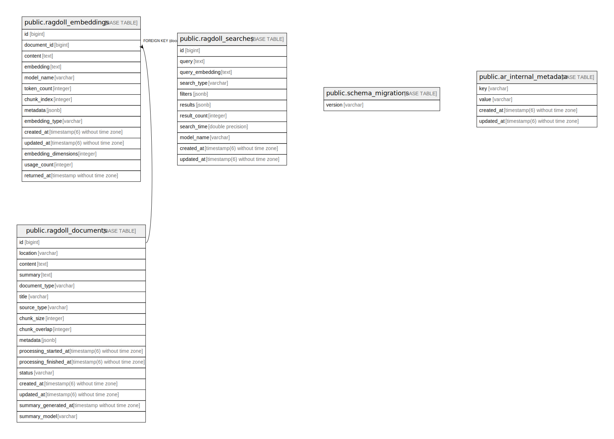

# ragdoll_demo_development

## Tables

| Name | Columns | Comment | Type |
| ---- | ------- | ------- | ---- |
| [public.ragdoll_documents](public.ragdoll_documents.md) | 17 |  | BASE TABLE |
| [public.ragdoll_embeddings](public.ragdoll_embeddings.md) | 14 |  | BASE TABLE |
| [public.ragdoll_searches](public.ragdoll_searches.md) | 11 |  | BASE TABLE |
| [public.schema_migrations](public.schema_migrations.md) | 1 |  | BASE TABLE |
| [public.ar_internal_metadata](public.ar_internal_metadata.md) | 4 |  | BASE TABLE |

## Stored procedures and functions

| Name | ReturnType | Arguments | Type |
| ---- | ------- | ------- | ---- |
| public.levenshtein | int4 | text, text | FUNCTION |
| public.levenshtein | int4 | text, text, integer, integer, integer | FUNCTION |
| public.levenshtein_less_equal | int4 | text, text, integer | FUNCTION |
| public.levenshtein_less_equal | int4 | text, text, integer, integer, integer, integer | FUNCTION |
| public.metaphone | text | text, integer | FUNCTION |
| public.soundex | text | text | FUNCTION |
| public.text_soundex | text | text | FUNCTION |
| public.difference | int4 | text, text | FUNCTION |
| public.dmetaphone | text | text | FUNCTION |
| public.dmetaphone_alt | text | text | FUNCTION |
| public.daitch_mokotoff | _text | text | FUNCTION |
| public.set_limit | float4 | real | FUNCTION |
| public.show_limit | float4 |  | FUNCTION |
| public.show_trgm | _text | text | FUNCTION |
| public.similarity | float4 | text, text | FUNCTION |
| public.similarity_op | bool | text, text | FUNCTION |
| public.word_similarity | float4 | text, text | FUNCTION |
| public.word_similarity_op | bool | text, text | FUNCTION |
| public.word_similarity_commutator_op | bool | text, text | FUNCTION |
| public.similarity_dist | float4 | text, text | FUNCTION |
| public.word_similarity_dist_op | float4 | text, text | FUNCTION |
| public.word_similarity_dist_commutator_op | float4 | text, text | FUNCTION |
| public.gtrgm_in | gtrgm | cstring | FUNCTION |
| public.gtrgm_out | cstring | gtrgm | FUNCTION |
| public.gtrgm_consistent | bool | internal, text, smallint, oid, internal | FUNCTION |
| public.gtrgm_distance | float8 | internal, text, smallint, oid, internal | FUNCTION |
| public.gtrgm_compress | internal | internal | FUNCTION |
| public.gtrgm_decompress | internal | internal | FUNCTION |
| public.gtrgm_penalty | internal | internal, internal, internal | FUNCTION |
| public.gtrgm_picksplit | internal | internal, internal | FUNCTION |
| public.gtrgm_union | gtrgm | internal, internal | FUNCTION |
| public.gtrgm_same | internal | gtrgm, gtrgm, internal | FUNCTION |
| public.gin_extract_value_trgm | internal | text, internal | FUNCTION |
| public.gin_extract_query_trgm | internal | text, internal, smallint, internal, internal, internal, internal | FUNCTION |
| public.gin_trgm_consistent | bool | internal, smallint, text, integer, internal, internal, internal, internal | FUNCTION |
| public.gin_trgm_triconsistent | char | internal, smallint, text, integer, internal, internal, internal | FUNCTION |
| public.strict_word_similarity | float4 | text, text | FUNCTION |
| public.strict_word_similarity_op | bool | text, text | FUNCTION |
| public.strict_word_similarity_commutator_op | bool | text, text | FUNCTION |
| public.strict_word_similarity_dist_op | float4 | text, text | FUNCTION |
| public.strict_word_similarity_dist_commutator_op | float4 | text, text | FUNCTION |
| public.gtrgm_options | void | internal | FUNCTION |
| public.vector_in | vector | cstring, oid, integer | FUNCTION |
| public.vector_out | cstring | vector | FUNCTION |
| public.vector_typmod_in | int4 | cstring[] | FUNCTION |
| public.vector_recv | vector | internal, oid, integer | FUNCTION |
| public.vector_send | bytea | vector | FUNCTION |
| public.l2_distance | float8 | vector, vector | FUNCTION |
| public.inner_product | float8 | vector, vector | FUNCTION |
| public.cosine_distance | float8 | vector, vector | FUNCTION |
| public.l1_distance | float8 | vector, vector | FUNCTION |
| public.vector_dims | int4 | vector | FUNCTION |
| public.vector_norm | float8 | vector | FUNCTION |
| public.l2_normalize | vector | vector | FUNCTION |
| public.binary_quantize | bit | vector | FUNCTION |
| public.subvector | vector | vector, integer, integer | FUNCTION |
| public.vector_add | vector | vector, vector | FUNCTION |
| public.vector_sub | vector | vector, vector | FUNCTION |
| public.vector_mul | vector | vector, vector | FUNCTION |
| public.vector_concat | vector | vector, vector | FUNCTION |
| public.vector_lt | bool | vector, vector | FUNCTION |
| public.vector_le | bool | vector, vector | FUNCTION |
| public.vector_eq | bool | vector, vector | FUNCTION |
| public.vector_ne | bool | vector, vector | FUNCTION |
| public.vector_ge | bool | vector, vector | FUNCTION |
| public.vector_gt | bool | vector, vector | FUNCTION |
| public.vector_cmp | int4 | vector, vector | FUNCTION |
| public.vector_l2_squared_distance | float8 | vector, vector | FUNCTION |
| public.vector_negative_inner_product | float8 | vector, vector | FUNCTION |
| public.vector_spherical_distance | float8 | vector, vector | FUNCTION |
| public.vector_accum | _float8 | double precision[], vector | FUNCTION |
| public.vector_avg | vector | double precision[] | FUNCTION |
| public.vector_combine | _float8 | double precision[], double precision[] | FUNCTION |
| public.avg | vector | vector | a |
| public.sum | vector | vector | a |
| public.vector | vector | vector, integer, boolean | FUNCTION |
| public.array_to_vector | vector | integer[], integer, boolean | FUNCTION |
| public.array_to_vector | vector | real[], integer, boolean | FUNCTION |
| public.array_to_vector | vector | double precision[], integer, boolean | FUNCTION |
| public.array_to_vector | vector | numeric[], integer, boolean | FUNCTION |
| public.vector_to_float4 | _float4 | vector, integer, boolean | FUNCTION |
| public.ivfflathandler | index_am_handler | internal | FUNCTION |
| public.hnswhandler | index_am_handler | internal | FUNCTION |
| public.ivfflat_halfvec_support | internal | internal | FUNCTION |
| public.ivfflat_bit_support | internal | internal | FUNCTION |
| public.hnsw_halfvec_support | internal | internal | FUNCTION |
| public.hnsw_bit_support | internal | internal | FUNCTION |
| public.hnsw_sparsevec_support | internal | internal | FUNCTION |
| public.halfvec_in | halfvec | cstring, oid, integer | FUNCTION |
| public.halfvec_out | cstring | halfvec | FUNCTION |
| public.halfvec_typmod_in | int4 | cstring[] | FUNCTION |
| public.halfvec_recv | halfvec | internal, oid, integer | FUNCTION |
| public.halfvec_send | bytea | halfvec | FUNCTION |
| public.l2_distance | float8 | halfvec, halfvec | FUNCTION |
| public.inner_product | float8 | halfvec, halfvec | FUNCTION |
| public.cosine_distance | float8 | halfvec, halfvec | FUNCTION |
| public.l1_distance | float8 | halfvec, halfvec | FUNCTION |
| public.vector_dims | int4 | halfvec | FUNCTION |
| public.l2_norm | float8 | halfvec | FUNCTION |
| public.l2_normalize | halfvec | halfvec | FUNCTION |
| public.binary_quantize | bit | halfvec | FUNCTION |
| public.subvector | halfvec | halfvec, integer, integer | FUNCTION |
| public.halfvec_add | halfvec | halfvec, halfvec | FUNCTION |
| public.halfvec_sub | halfvec | halfvec, halfvec | FUNCTION |
| public.halfvec_mul | halfvec | halfvec, halfvec | FUNCTION |
| public.halfvec_concat | halfvec | halfvec, halfvec | FUNCTION |
| public.halfvec_lt | bool | halfvec, halfvec | FUNCTION |
| public.halfvec_le | bool | halfvec, halfvec | FUNCTION |
| public.halfvec_eq | bool | halfvec, halfvec | FUNCTION |
| public.halfvec_ne | bool | halfvec, halfvec | FUNCTION |
| public.halfvec_ge | bool | halfvec, halfvec | FUNCTION |
| public.halfvec_gt | bool | halfvec, halfvec | FUNCTION |
| public.halfvec_cmp | int4 | halfvec, halfvec | FUNCTION |
| public.halfvec_l2_squared_distance | float8 | halfvec, halfvec | FUNCTION |
| public.halfvec_negative_inner_product | float8 | halfvec, halfvec | FUNCTION |
| public.halfvec_spherical_distance | float8 | halfvec, halfvec | FUNCTION |
| public.halfvec_accum | _float8 | double precision[], halfvec | FUNCTION |
| public.halfvec_avg | halfvec | double precision[] | FUNCTION |
| public.halfvec_combine | _float8 | double precision[], double precision[] | FUNCTION |
| public.avg | halfvec | halfvec | a |
| public.sum | halfvec | halfvec | a |
| public.halfvec | halfvec | halfvec, integer, boolean | FUNCTION |
| public.halfvec_to_vector | vector | halfvec, integer, boolean | FUNCTION |
| public.vector_to_halfvec | halfvec | vector, integer, boolean | FUNCTION |
| public.array_to_halfvec | halfvec | integer[], integer, boolean | FUNCTION |
| public.array_to_halfvec | halfvec | real[], integer, boolean | FUNCTION |
| public.array_to_halfvec | halfvec | double precision[], integer, boolean | FUNCTION |
| public.array_to_halfvec | halfvec | numeric[], integer, boolean | FUNCTION |
| public.halfvec_to_float4 | _float4 | halfvec, integer, boolean | FUNCTION |
| public.hamming_distance | float8 | bit, bit | FUNCTION |
| public.jaccard_distance | float8 | bit, bit | FUNCTION |
| public.sparsevec_in | sparsevec | cstring, oid, integer | FUNCTION |
| public.sparsevec_out | cstring | sparsevec | FUNCTION |
| public.sparsevec_typmod_in | int4 | cstring[] | FUNCTION |
| public.sparsevec_recv | sparsevec | internal, oid, integer | FUNCTION |
| public.sparsevec_send | bytea | sparsevec | FUNCTION |
| public.l2_distance | float8 | sparsevec, sparsevec | FUNCTION |
| public.inner_product | float8 | sparsevec, sparsevec | FUNCTION |
| public.cosine_distance | float8 | sparsevec, sparsevec | FUNCTION |
| public.l1_distance | float8 | sparsevec, sparsevec | FUNCTION |
| public.l2_norm | float8 | sparsevec | FUNCTION |
| public.l2_normalize | sparsevec | sparsevec | FUNCTION |
| public.sparsevec_lt | bool | sparsevec, sparsevec | FUNCTION |
| public.sparsevec_le | bool | sparsevec, sparsevec | FUNCTION |
| public.sparsevec_eq | bool | sparsevec, sparsevec | FUNCTION |
| public.sparsevec_ne | bool | sparsevec, sparsevec | FUNCTION |
| public.sparsevec_ge | bool | sparsevec, sparsevec | FUNCTION |
| public.sparsevec_gt | bool | sparsevec, sparsevec | FUNCTION |
| public.sparsevec_cmp | int4 | sparsevec, sparsevec | FUNCTION |
| public.sparsevec_l2_squared_distance | float8 | sparsevec, sparsevec | FUNCTION |
| public.sparsevec_negative_inner_product | float8 | sparsevec, sparsevec | FUNCTION |
| public.sparsevec | sparsevec | sparsevec, integer, boolean | FUNCTION |
| public.vector_to_sparsevec | sparsevec | vector, integer, boolean | FUNCTION |
| public.sparsevec_to_vector | vector | sparsevec, integer, boolean | FUNCTION |
| public.halfvec_to_sparsevec | sparsevec | halfvec, integer, boolean | FUNCTION |
| public.sparsevec_to_halfvec | halfvec | sparsevec, integer, boolean | FUNCTION |
| public.array_to_sparsevec | sparsevec | integer[], integer, boolean | FUNCTION |
| public.array_to_sparsevec | sparsevec | real[], integer, boolean | FUNCTION |
| public.array_to_sparsevec | sparsevec | double precision[], integer, boolean | FUNCTION |
| public.array_to_sparsevec | sparsevec | numeric[], integer, boolean | FUNCTION |

## Relations

---

> Generated by [tbls](https://github.com/k1LoW/tbls)
