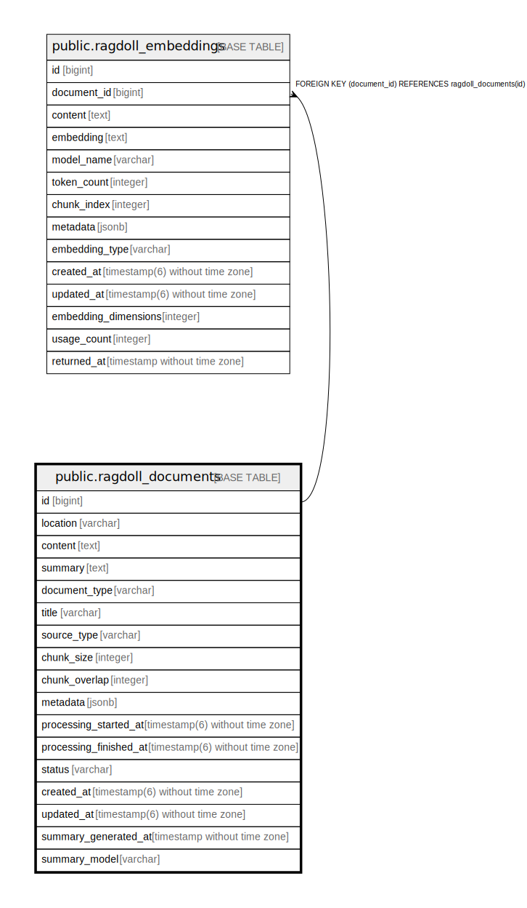

# public.ragdoll_documents

## Description

## Columns

| Name | Type | Default | Nullable | Children | Parents | Comment |
| ---- | ---- | ------- | -------- | -------- | ------- | ------- |
| id | bigint | nextval('ragdoll_documents_id_seq'::regclass) | false | [public.ragdoll_embeddings](public.ragdoll_embeddings.md) |  |  |
| location | varchar |  | false |  |  |  |
| content | text |  | true |  |  |  |
| summary | text |  | true |  |  |  |
| document_type | varchar |  | true |  |  |  |
| title | varchar |  | true |  |  |  |
| source_type | varchar |  | true |  |  |  |
| chunk_size | integer |  | true |  |  |  |
| chunk_overlap | integer |  | true |  |  |  |
| metadata | jsonb | '{}'::jsonb | true |  |  |  |
| processing_started_at | timestamp(6) without time zone |  | true |  |  |  |
| processing_finished_at | timestamp(6) without time zone |  | true |  |  |  |
| status | varchar | 'pending'::character varying | true |  |  |  |
| created_at | timestamp(6) without time zone |  | false |  |  |  |
| updated_at | timestamp(6) without time zone |  | false |  |  |  |
| summary_generated_at | timestamp without time zone |  | true |  |  |  |
| summary_model | varchar |  | true |  |  |  |

## Constraints

| Name | Type | Definition |
| ---- | ---- | ---------- |
| ragdoll_documents_pkey | PRIMARY KEY | PRIMARY KEY (id) |

## Indexes

| Name | Definition |
| ---- | ---------- |
| ragdoll_documents_pkey | CREATE UNIQUE INDEX ragdoll_documents_pkey ON public.ragdoll_documents USING btree (id) |
| index_ragdoll_documents_on_document_type | CREATE INDEX index_ragdoll_documents_on_document_type ON public.ragdoll_documents USING btree (document_type) |
| index_ragdoll_documents_on_location | CREATE UNIQUE INDEX index_ragdoll_documents_on_location ON public.ragdoll_documents USING btree (location) |
| index_ragdoll_documents_on_metadata | CREATE INDEX index_ragdoll_documents_on_metadata ON public.ragdoll_documents USING gin (metadata) |
| index_ragdoll_documents_on_processing_started_at | CREATE INDEX index_ragdoll_documents_on_processing_started_at ON public.ragdoll_documents USING btree (processing_started_at) |
| index_ragdoll_documents_on_status | CREATE INDEX index_ragdoll_documents_on_status ON public.ragdoll_documents USING btree (status) |
| index_ragdoll_documents_on_summary_generated_at | CREATE INDEX index_ragdoll_documents_on_summary_generated_at ON public.ragdoll_documents USING btree (summary_generated_at) |
| index_ragdoll_documents_on_summary_model | CREATE INDEX index_ragdoll_documents_on_summary_model ON public.ragdoll_documents USING btree (summary_model) |

## Relations

---

> Generated by [tbls](https://github.com/k1LoW/tbls)
