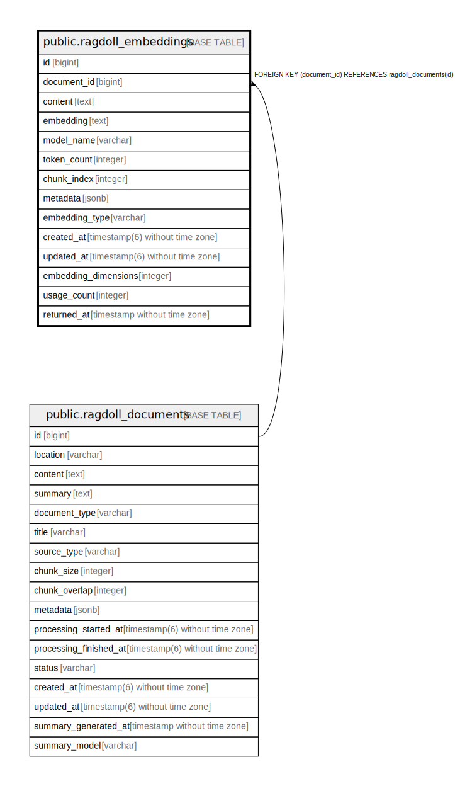

# public.ragdoll_embeddings

## Description

## Columns

| Name | Type | Default | Nullable | Children | Parents | Comment |
| ---- | ---- | ------- | -------- | -------- | ------- | ------- |
| id | bigint | nextval('ragdoll_embeddings_id_seq'::regclass) | false |  |  |  |
| document_id | bigint |  | false |  | [public.ragdoll_documents](public.ragdoll_documents.md) |  |
| content | text |  | false |  |  |  |
| embedding | text |  | true |  |  |  |
| model_name | varchar |  | true |  |  |  |
| token_count | integer |  | true |  |  |  |
| chunk_index | integer |  | true |  |  |  |
| metadata | jsonb | '{}'::jsonb | true |  |  |  |
| embedding_type | varchar | 'text'::character varying | true |  |  |  |
| created_at | timestamp(6) without time zone |  | false |  |  |  |
| updated_at | timestamp(6) without time zone |  | false |  |  |  |
| embedding_dimensions | integer |  | true |  |  |  |
| usage_count | integer | 0 | false |  |  |  |
| returned_at | timestamp without time zone |  | true |  |  |  |

## Constraints

| Name | Type | Definition |
| ---- | ---- | ---------- |
| fk_rails_a26273cc7b | FOREIGN KEY | FOREIGN KEY (document_id) REFERENCES ragdoll_documents(id) |
| ragdoll_embeddings_pkey | PRIMARY KEY | PRIMARY KEY (id) |

## Indexes

| Name | Definition |
| ---- | ---------- |
| ragdoll_embeddings_pkey | CREATE UNIQUE INDEX ragdoll_embeddings_pkey ON public.ragdoll_embeddings USING btree (id) |
| index_ragdoll_embeddings_on_chunk_index | CREATE INDEX index_ragdoll_embeddings_on_chunk_index ON public.ragdoll_embeddings USING btree (chunk_index) |
| index_ragdoll_embeddings_on_document_id | CREATE INDEX index_ragdoll_embeddings_on_document_id ON public.ragdoll_embeddings USING btree (document_id) |
| index_ragdoll_embeddings_on_embedding_dimensions | CREATE INDEX index_ragdoll_embeddings_on_embedding_dimensions ON public.ragdoll_embeddings USING btree (embedding_dimensions) |
| index_ragdoll_embeddings_on_embedding_type | CREATE INDEX index_ragdoll_embeddings_on_embedding_type ON public.ragdoll_embeddings USING btree (embedding_type) |
| index_ragdoll_embeddings_on_metadata | CREATE INDEX index_ragdoll_embeddings_on_metadata ON public.ragdoll_embeddings USING gin (metadata) |
| index_ragdoll_embeddings_on_model_and_dimensions | CREATE INDEX index_ragdoll_embeddings_on_model_and_dimensions ON public.ragdoll_embeddings USING btree (model_name, embedding_dimensions) |
| index_ragdoll_embeddings_on_returned_at | CREATE INDEX index_ragdoll_embeddings_on_returned_at ON public.ragdoll_embeddings USING btree (returned_at) |
| index_ragdoll_embeddings_on_usage_and_recency | CREATE INDEX index_ragdoll_embeddings_on_usage_and_recency ON public.ragdoll_embeddings USING btree (usage_count, returned_at) |
| index_ragdoll_embeddings_on_usage_count | CREATE INDEX index_ragdoll_embeddings_on_usage_count ON public.ragdoll_embeddings USING btree (usage_count) |

## Relations

---

> Generated by [tbls](https://github.com/k1LoW/tbls)
