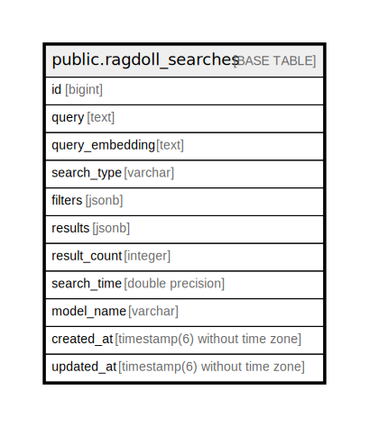

# public.ragdoll_searches

## Description

## Columns

| Name | Type | Default | Nullable | Children | Parents | Comment |
| ---- | ---- | ------- | -------- | -------- | ------- | ------- |
| id | bigint | nextval('ragdoll_searches_id_seq'::regclass) | false |  |  |  |
| query | text |  | false |  |  |  |
| query_embedding | text |  | true |  |  |  |
| search_type | varchar | 'semantic'::character varying | true |  |  |  |
| filters | jsonb | '{}'::jsonb | true |  |  |  |
| results | jsonb | '{}'::jsonb | true |  |  |  |
| result_count | integer | 0 | true |  |  |  |
| search_time | double precision |  | true |  |  |  |
| model_name | varchar |  | true |  |  |  |
| created_at | timestamp(6) without time zone |  | false |  |  |  |
| updated_at | timestamp(6) without time zone |  | false |  |  |  |

## Constraints

| Name | Type | Definition |
| ---- | ---- | ---------- |
| ragdoll_searches_pkey | PRIMARY KEY | PRIMARY KEY (id) |

## Indexes

| Name | Definition |
| ---- | ---------- |
| ragdoll_searches_pkey | CREATE UNIQUE INDEX ragdoll_searches_pkey ON public.ragdoll_searches USING btree (id) |
| index_ragdoll_searches_on_created_at | CREATE INDEX index_ragdoll_searches_on_created_at ON public.ragdoll_searches USING btree (created_at) |
| index_ragdoll_searches_on_search_type | CREATE INDEX index_ragdoll_searches_on_search_type ON public.ragdoll_searches USING btree (search_type) |

## Relations

---

> Generated by [tbls](https://github.com/k1LoW/tbls)
